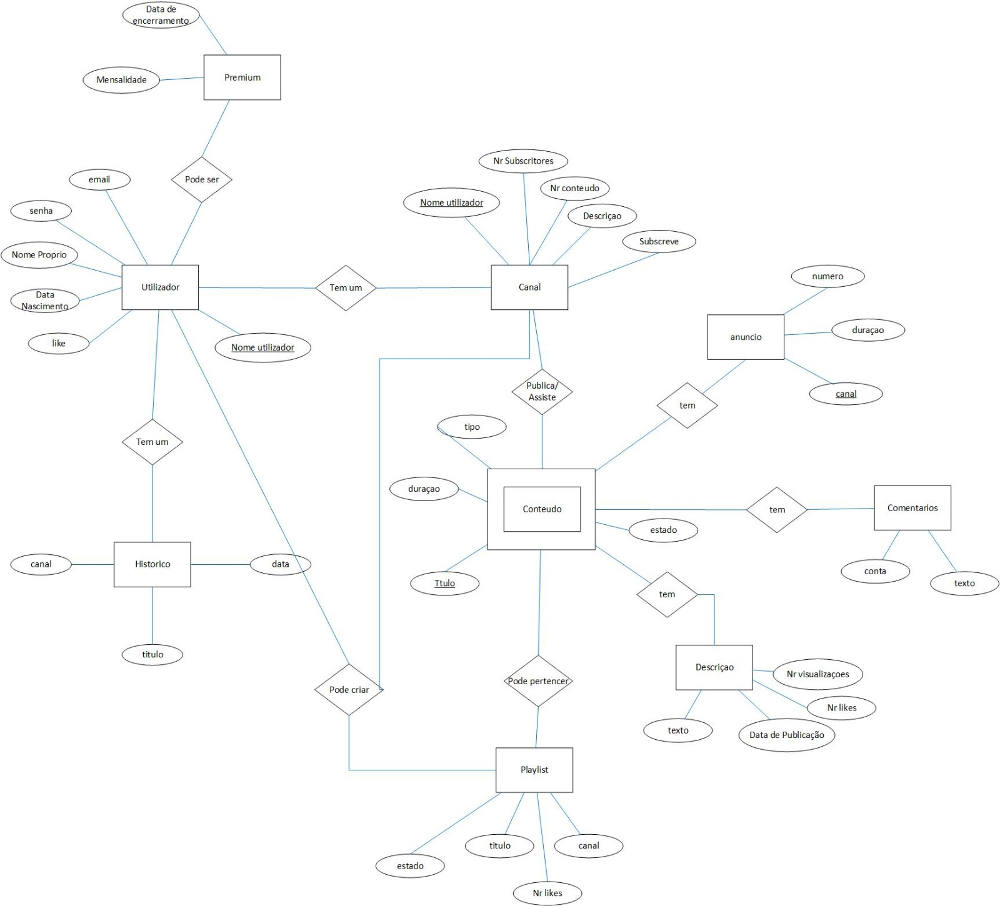

# BD: Trabalho Prático APFE

**Grupo**: PXGY
- Vasco Faria, MEC: 107323
- Cristiano Nicolau, MEC: 108536

## Introdução / Introduction
 
O nosso projeto final é uma modelação de uma base de dados sobre a plataforma Youtube que permite que os utilizadores publiquem e visualizem o  conteúdo publicado podendo ser vídeos, lives e reals no site, podendo ainda fazer diversas coisas como subscrever outros utilizadores, dar like, comentar conteúdo, fazer playlists e ainda subscrever o premium. 

## ​Análise de Requisitos / Requirements

- O utilizador tem de criar uma conta, registando-se com um e-mail, uma senha de acesso, nome de utilizador, nome próprio, data de nascimento. O utilizador pode ainda subscrever o premium que tem uma mensalidade e uma data de encerramento.  Pode ainda dar like em cada vídeo que vê.
- O utilizador tem um histórico com a data da visualização dos vídeos que viu e ainda o nome dos vídeos e o canal ao qual o vídeo pertence.
- Cada canal pertence a um utilizador tem o número de seguidores, o número de conteúdo disponível, e tem ainda uma descrição e pode subscrever outros canais.	
- O conteúdo disponível pertence a um canal e pode ser assistido por um utilizador, cada conteúdo tem uma duração, o número de likes, uma descrição, os comentários e um título. A descrição tem um número de visualizações, uma data de publicação um texto. O comentário pertence a um canal e tem o respetivo texto. O conteúdo pode ainda pertencer a uma playlist que tem um nome, número de likes , pertence a um canal e pode ser privada ou não. Alem disso o conteúdo tem anúncios que tem a duração pertence ao canal da empresa e número de anúncios.
- O conteúdo disponível tem 3 estados: publico, privado e não listado e pode ainda ser de 3 tipos: video, live, reels. 
- Cada conteúdo tem anúncios, mas caso o utilizador seja premium já não tem.

## DER

## ER

