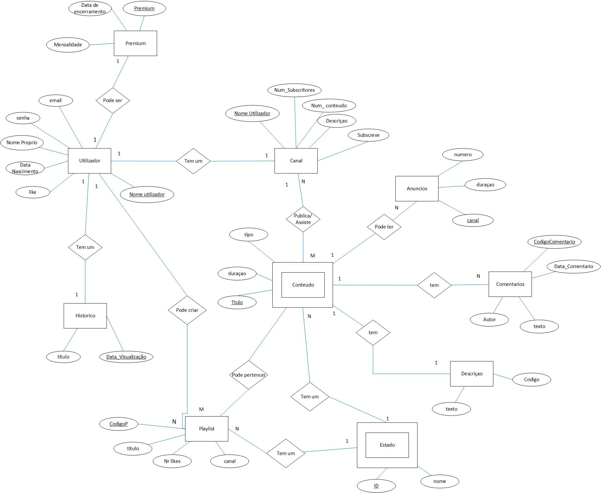
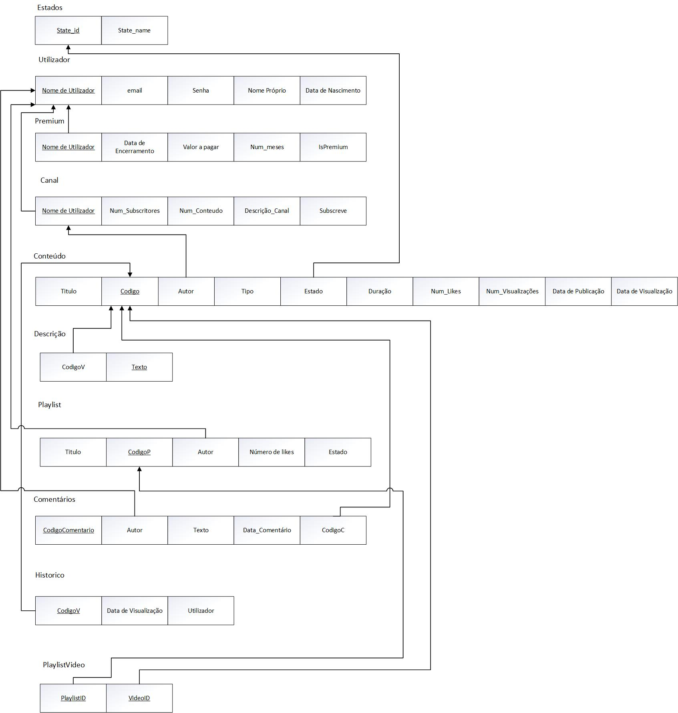

# BD: Trabalho Prático APF-T Youtube

**Grupo**: P5G2
- Vasco Faria, MEC: 107323
- Cristiano Nicolau, MEC: 108536

# Instructions - TO REMOVE

This template is flexible.
It is suggested to follow the structure, file links and images but add more content where necessary.

The files should be organized with the following nomenclature:

- sql\01_ddl.sql: mandatory for DDL
- sql\02_sp_functions.sql: mandatory for Store Procedure, Functions,... 
- sql\03_triggers.sql: mandatory for triggers
- sql\04_db_init.sql: scripts to init the database (i.e. inserts etc.)
- sql\05_any_other_matter.sql: any other scripts.

Por favor remova esta secção antes de submeter.

Please remove this section before submitting.

## Introdução / Introduction
 
O nosso projeto final é uma modelação de uma base de dados sobre a plataforma Youtube.
Permite aos utilizadores enviar, compartilhas e visualizar conteudos, que podem ser de varios tipos.
Podem ainda subscrever outros utilizadores, dar like, comentar conteúdo, criar playlist e ainda assinar o premium. 

## ​Análise de Requisitos / Requirements

- O utilizador tem de criar uma conta, registando-se com um e-mail, uma senha de acesso, nome de utilizador, nome próprio, data de nascimento.
- O utilizador pode ainda subscrever o premium que tem uma mensalidade, um valor a pagar e uma data de encerramento.  Pode ainda dar like em cada vídeo que vê.
- O utilizador tem um histórico com a data da visualização dos vídeos que deu like e ainda o nome dos vídeos e o canal ao qual o vídeo pertence.
- O conteúdo disponível pertence a um canal e pode ser assistido por um utilizador, cada conteúdo tem uma duração, o número de likes, uma descrição, os comentários e um título. 
- A descrição tem um número de visualizações, uma data de publicação e um texto.
- O comentário pertence a um canal e tem o respetivo texto.
- O conteúdo pode ainda pertencer a uma playlist que tem um nome, número de likes, pertence a um canal e pode ser privada ou não. Alem disso o conteúdo tem anúncios que tem o número de anúncios, a duração e pertence ao canal da empresa.
- Cada canal pertence a um utilizador tem o número de seguidores, o número de conteúdo disponível, e tem ainda uma descrição e pode subscrever outros canais.	
- O conteúdo disponível tem 3 estados: publico, privado e não listado e pode ainda ser de 3 tipos: video, live, reels. 
- Cada conteúdo tem anúncios, mas caso o utilizador seja premium já não tem.

## DER - Diagrama Entidade Relacionamento/Entity Relationship Diagram

### Versão final/Final version



### APFE 

- Mudanças na entidade Premium e na entidade Estado.
- Foram retirados alguns atributos desnecesários.
- Foram alterados alguns atributos.

## ER - Esquema Relacional/Relational Schema

### Versão final/Final Version



### APFE

- Adicionados alguns atributos necessarios para a ligaçaão da base de dados.
- Foram retiradas algumas ligaçoes desnecessárias, por exemplo haviam varias chaves a ir buscar valores diferentes a mesma entidade.


## ​SQL DDL - Data Definition Language

[SQL DDL File](sql/01_ddl.sql "SQLFileQuestion")

## SQL DML - Data Manipulation Language

Uma secção por formulário.
A section for each form.

### Formulario exemplo/Example Form


```sql
-- Show data on the form
SELECT * FROM MY_TABLE ....;

-- Insert new element
INSERT INTO MY_TABLE ....;
```

...

## Normalização/Normalization

Descreva os passos utilizados para minimizar a duplicação de dados / redução de espaço.
Justifique as opções tomadas.
Describe the steps used to minimize data duplication / space reduction.
Justify the choices made.

## Índices/Indexes

Descreva os indices criados. Junte uma cópia do SQL de criação do indice.
Describe the indexes created. Attach a copy of the SQL to create the index.

```sql
-- Create an index to speed
CREATE INDEX index_name ON table_name (column1, column2, ...);
```

## SQL Programming: Stored Procedures, Triggers, UDF

[SQL SPs and Functions File](sql/02_sp_functions.sql "SQLFileQuestion")

[SQL Triggers File](sql/03_triggers.sql "SQLFileQuestion")

## Outras notas/Other notes

### Dados iniciais da dabase de dados/Database init data 

[Indexes File](sql/Init.sql "SQLFileQuestion")


 