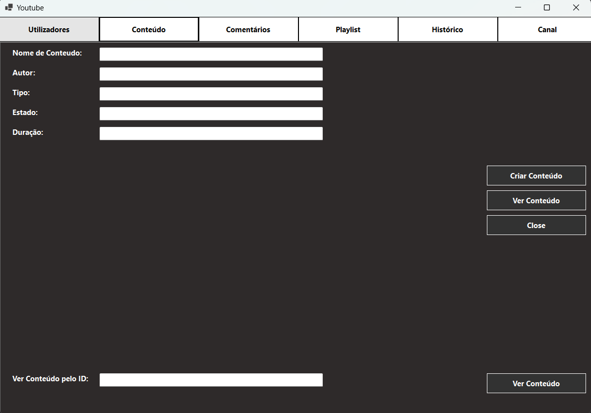
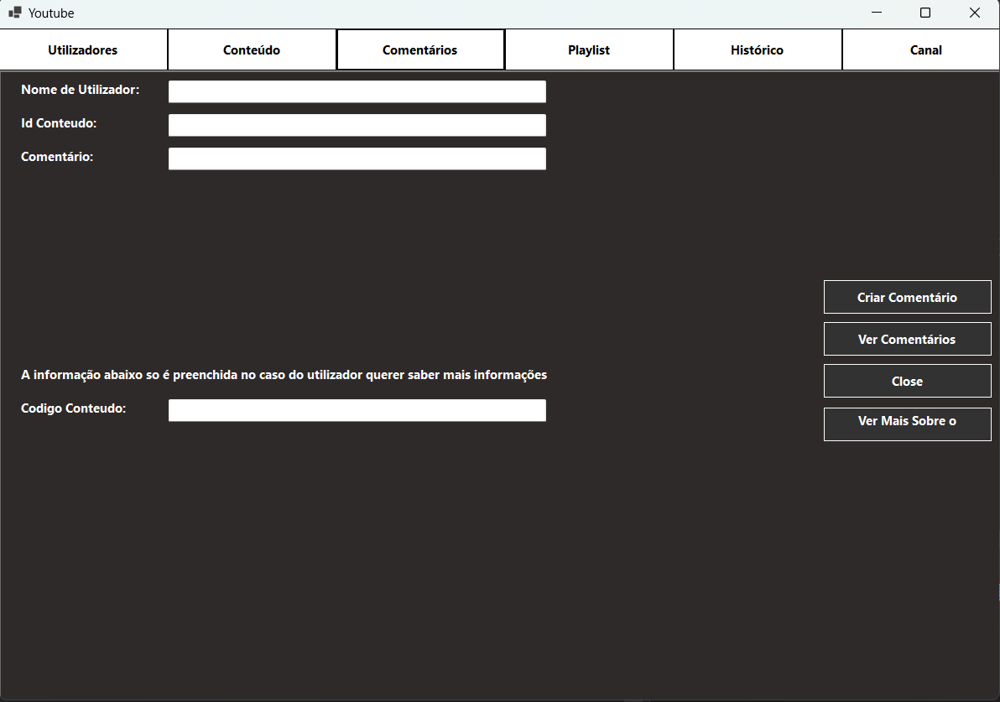
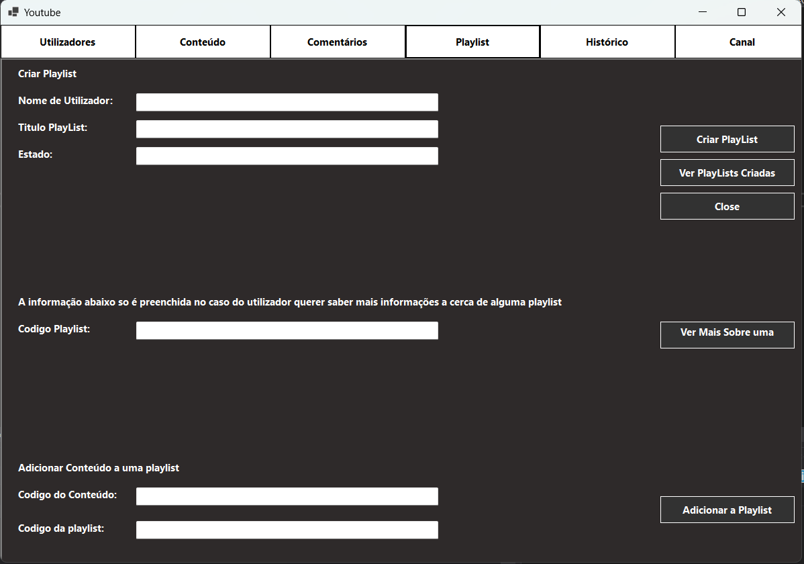
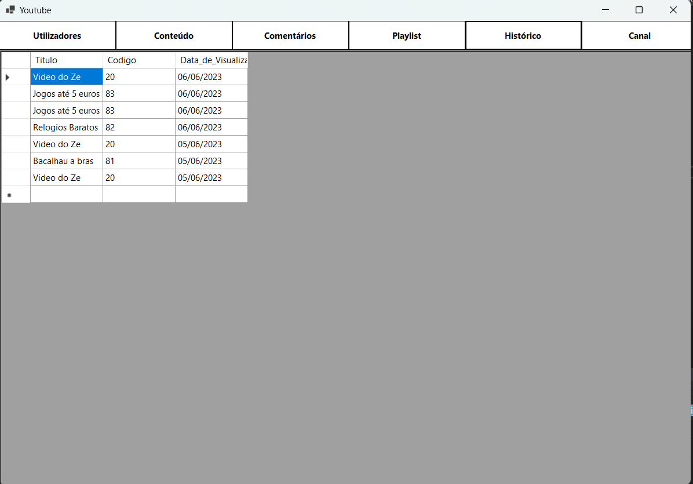
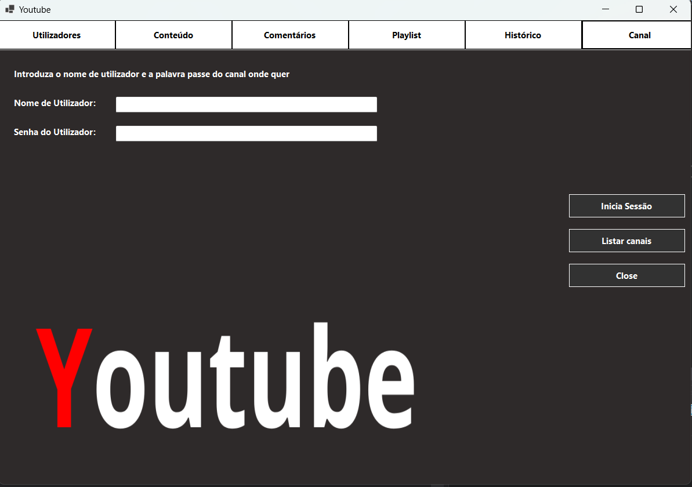
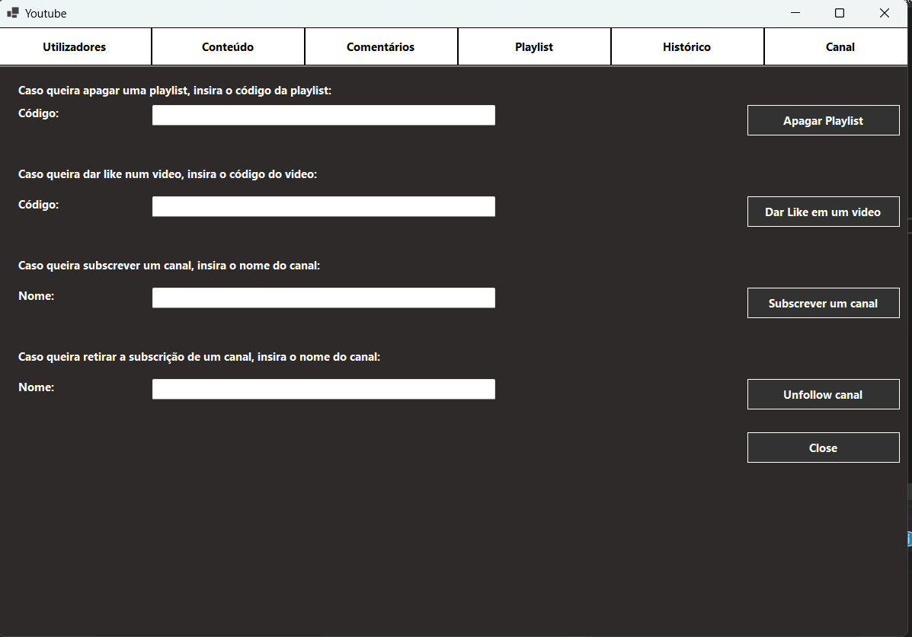

# BD: Trabalho Prático APF-T Youtube

**Grupo**: P5G2
- Vasco Faria, MEC: 107323
- Cristiano Nicolau, MEC: 108536
- 
## Introdução / Introduction
 
O nosso projeto final é uma modelação de uma base de dados sobre a plataforma Youtube.
Permite aos utilizadores enviar, compartilhas e visualizar conteudos, que podem ser de varios tipos.
Podem ainda subscrever outros utilizadores, dar like, comentar conteúdo, criar playlist e ainda assinar o premium. 

## ​Análise de Requisitos / Requirements

- O utilizador tem de criar uma conta, registando-se com um e-mail, uma senha de acesso, nome de utilizador, nome próprio, data de nascimento.
- O utilizador pode ainda subscrever o premium que tem uma mensalidade, um valor a pagar e uma data de encerramento.  Pode ainda dar like em cada vídeo que vê.
- O utilizador tem um histórico com a data da visualização dos vídeos que deu like e ainda o nome dos vídeos e o canal ao qual o vídeo pertence.
- O conteúdo disponível pertence a um canal e pode ser assistido por um utilizador, cada conteúdo tem uma duração, o número de likes, uma descrição, os comentários e um título. 
- A descrição tem um número de visualizações, uma data de publicação e um texto.
- O comentário pertence a um canal e tem o respetivo texto.
- O conteúdo pode ainda pertencer a uma playlist que tem um nome, número de likes, pertence a um canal e pode ser privada ou não. Alem disso o conteúdo tem anúncios que tem o número de anúncios, a duração e pertence ao canal da empresa.
- Cada canal pertence a um utilizador tem o número de seguidores, o número de conteúdo disponível, e tem ainda uma descrição e pode subscrever outros canais.	
- O conteúdo disponível tem 3 estados: publico, privado e não listado e pode ainda ser de 3 tipos: video, live, reels. 
- Cada conteúdo tem anúncios, mas caso o utilizador seja premium já não tem.

## DER - Diagrama Entidade Relacionamento/Entity Relationship Diagram

### Versão final/Final version


### APFE 

- Mudanças na entidade Premium e na entidade Estado.
- Foram retirados alguns atributos desnecesários.
- Foram alterados alguns atributos.

## ER - Esquema Relacional/Relational Schema

### Versão final/Final Version


### APFE

- Adicionados alguns atributos necessarios para a ligaçaão da base de dados.
- Foram retiradas algumas ligações desnecessárias, por exemplo haviam varias chaves a ir buscar valores diferentes a mesma entidade.


## ​SQL DDL - Data Definition Language

[SQL DDL File](sql/01_ddl.sql "SQLFileQuestion")

## SQL DML - Data Manipulation Language

### Formulário Utilizadores


<br>

```c#
//Adicionar Utilizador
string query = "SELECT u.Nome_Utilizador, u.Senha, c.Num_Subscritores, c.Num_Conteudo, c.Descrição_Canal " +
                "FROM [p5g2].[Youtube].[Utilizador] u " +
                "INNER JOIN [p5g2].[Youtube].[Canal] c ON u.Nome_Utilizador = c.Nome_Utilizador " +
                "WHERE u.Nome_Utilizador = c.Nome_Utilizador";

//Listar Utilzadores
string query = "SELECT U.Nome_Utilizador, U.Email, U.Nome, U.Data_de_Nascimento, CASE WHEN P.IsPremium = 1 THEN 'Premium' ELSE '' END AS Premium,  P.Data_de_Encerramento, P.Valor_a_pagar FROM[p5g2].[Youtube].[Utilizador] U LEFT JOIN[p5g2].[Youtube].[Premium] P ON U.Nome_Utilizador = P.Nome_Utilizador;";

//submeter Premium
string query = "INSERT INTO Youtube.Premium (Nome_Utilizador, Num_Meses) " +
                "VALUES (@Nome_Utilizador,@meses)";

```
<br>

### Formulário Conteúdo


<br>

```c#

//Adicionar Conteúdo
string query = "INSERT INTO [p5g2].[Youtube].[Conteúdo] (Titulo, Autor, Tipo, Estado, Duracao) VALUES(@Titulo, @autor, @Tipo, @estado, @dura);";

//Listar todos os conteúdos
string query = "SELECT C.Codigo, C.Titulo, C.Autor, C.Tipo, E.state_name AS Estado, C.Duracao, C.Num_Likes, C.Num_Views, C.Data_Pub FROM Youtube.Conteúdo C JOIN Youtube.Estados E ON C.Estado = E.state_id";

//Update ao número de views após visualizaçção do conteúdo
string updateQuery = "UPDATE [Youtube].[Conteúdo] SET Num_Views = Num_Views+1 WHERE Codigo = @Codigo";

//Inserir conteúdo no Historico
string insertQuery = "INSERT INTO [Youtube].[Historico] (Titulo, Codigo, Data_de_Visualizacao) " +
                                         "SELECT Titulo, Codigo, GETDATE() FROM [Youtube].[Conteúdo] WHERE Codigo = @Codigo";

```
<br>

### Formulário Comentário



<br>

```c#
//Inserir comentário num certo 
string query = "INSERT INTO Youtube.Comentários (Autor,Texto,Codigo) " +
                "VALUES (@Autor, @Texto, @CódigoV)";

//Listar todos os comentários
string query = "SELECT * FROM [p5g2].[Youtube].[Comentários]";

//Listar Comentários de um certo Conteúdo
string query = @"SELECT c.Titulo AS NomeConteudo,
                u.Nome_Utilizador AS NomeUtilizador, 
                com.Autor, com.Texto AS Comentario, com.Data_Comentário
                FROM Youtube.Conteúdo c
                INNER JOIN Youtube.Canal cn ON c.Autor = cn.Nome_Utilizador
                INNER JOIN Youtube.Comentários com ON com.Codigo = c.Codigo
                INNER JOIN Youtube.Utilizador u ON u.Nome_Utilizador = com.Autor
                WHERE c.Codigo = @idConteudo;";
```
<br>

### Formulário Playlist



<br>

```c#

//Adicionar Conteudo a uma Playlist
string query = "Youtube.AdicionarContentNaPlaylist";

//Criar Playlist
string query = "INSERT INTO Youtube.Playlist (Titulo, Autor, Num_Likes, Estado) " +
                "VALUES (@TituloPlaylist, @AutorPlaylist,  @Num_Likes, @Estado)";

//Listar todas as Playlists
string query = @"SELECT p.Titulo, p.CodigoP AS PlaylistID, [p5g2].[Youtube].CalculatePlaylistDuration(p.CodigoP) AS PlayList_Time_Duration,
                p.Autor, p.Num_Likes, e.state_name AS Estado
                FROM [p5g2].[Youtube].[Playlist] p
                JOIN [p5g2].[Youtube].[Estados] e ON p.Estado = e.state_id";

//Listar todo o conteúdo de uma playlist
string query= "SELECT C.Codigo, C.Titulo, C.Autor, C.Tipo, E.state_name AS Estado, C.Duracao, C.Num_Likes, C.Num_Views, C.Data_Pub FROM Youtube.Conteúdo AS C INNER JOIN Youtube.PlaylistVideo AS PV ON C.Codigo = PV.VideoID INNER JOIN Youtube.Estados AS E ON C.Estado = E.state_id WHERE PV.PlaylistID = @playlistID ";

```

<br>

### Formulário Histórico



<br>

```c#

//Listar historico de conteúdos visualizados
 string query = "SELECT Titulo, Codigo, Data_de_Visualizacao FROM[p5g2].[Youtube].[Historico] ORDER BY CodigoContentVisto DESC";

``` 

<br>

### Formulário Inicio Sessão Canal



<br>

```c#

//Iniciar Sessão 
string query = "SELECT [Youtube].[CheckCredentials](@NomeUtilizador, @Senha)";
 
``` 
<br>

### Formulário Canal



```C#

//Dar delete de uma playlist
"Youtube.DeletePlaylist"

//Dar likes em Conteúdos
string updateQuery = "UPDATE [Youtube].[Conteúdo] SET Num_Likes = Num_Likes + 1 WHERE Codigo = @Codigo";


//Deixar de Subscrever um canal
"Youtube.UpdateSubscribers2"

//Susbrever um canal
"Youtube.UpdateSubscribers"
```

<br>


## Normalização/Normalization

Existe clareza da semantica dos atributos das relações entre entidades.
Redução o número de nulls nos tuplos através criado mais relações para esses atributos.
Uso de chaves primárias e chaves estrangeiras para as relações entre entidades de modo a evitar a duplicação de dados. 

## Índices/Indexes

Índice na coluna "Data_de_Visualizacao" na tabela "Youtube.Histórico":
```sql
CREATE INDEX idx_Data_de_Visualizacao ON Youtube.Histórico (Data_de_Visualizacao);
```
Este indice melhora a ordenação do histórico por data_de_visualização do mais recente para o mais antigo.

<br>

Índice na coluna Nome_Utilizador na tabela Youtube.Utilizador:
```sql
CREATE INDEX idx_Nome_Utilizador ON Youtube.Utilizador (Nome_Utilizador);"
```
Indice que melhora o desempenho na pesquisa de Utilizadores.


## SQL Programming: Stored Procedures, Triggers, UDF

[SQL SPs and Functions File](sql/02_sp_functions.sql "SQLFileQuestion")

[SQL Triggers File](sql/03_triggers.sql "SQLFileQuestion")

## Outras notas/Other notes

### Dados iniciais da dabase de dados/Database init data 

[Indexes File](sql/04_db_init.sql "SQLFileQuestion")


### Apresentação do trabalho em aula

#### Apresentação PowerPoint

[Apresentação](presentation/apresentacaofinal.pptx "PowerPointFile")

#### Apresentação video demo

[Video Demo](presentation/videoapresentacaofinal.mp4 "Mp4File")

Após a apresentação do trabalho feito ocorreram devidas mudanças na interface, devido a criação de triggers, udfs e stored procedure, fazendo com que a demo do video nao esteja atualizada. 


 
