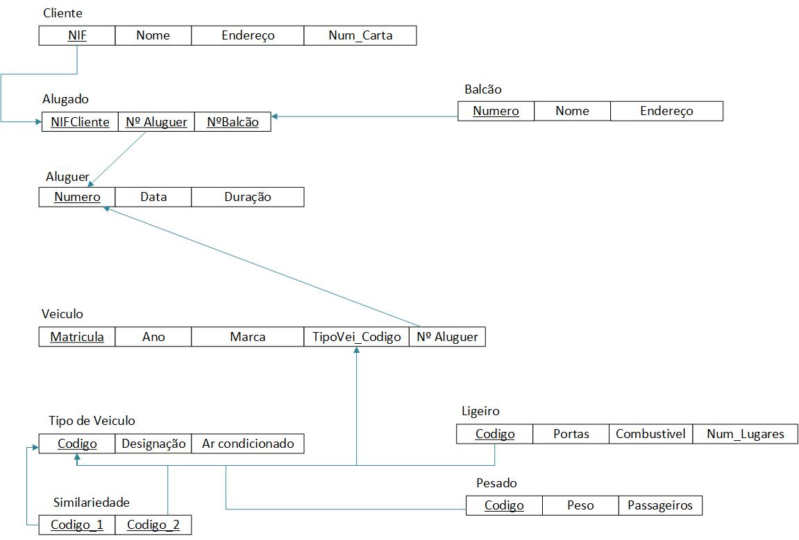
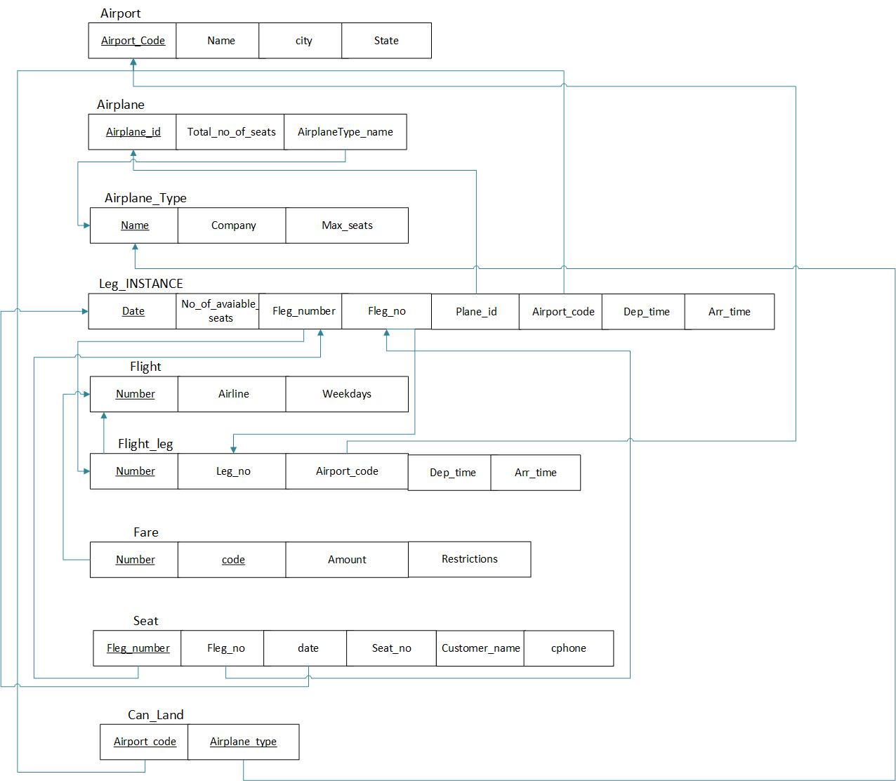
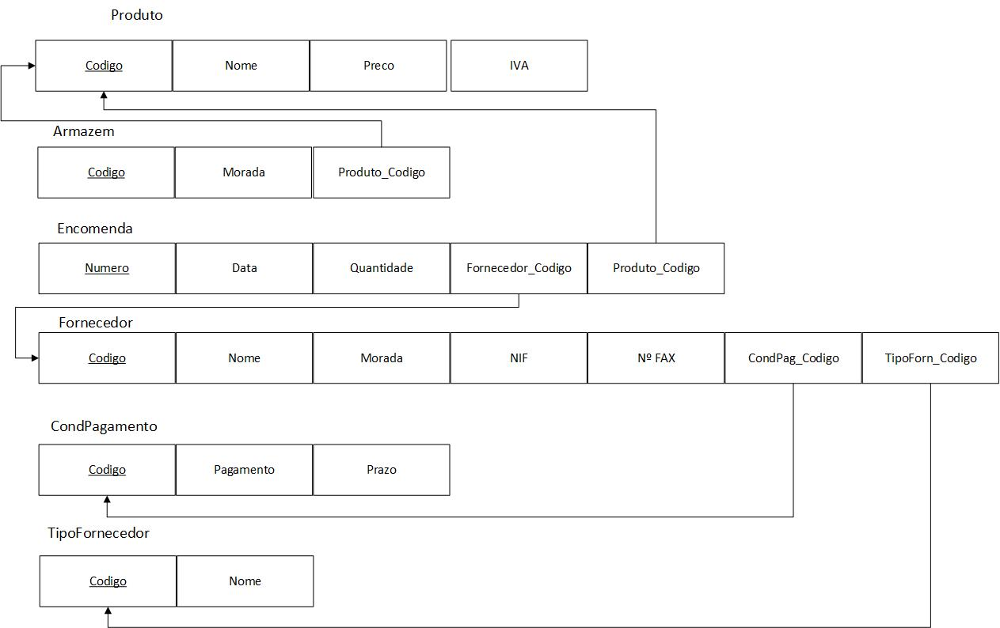
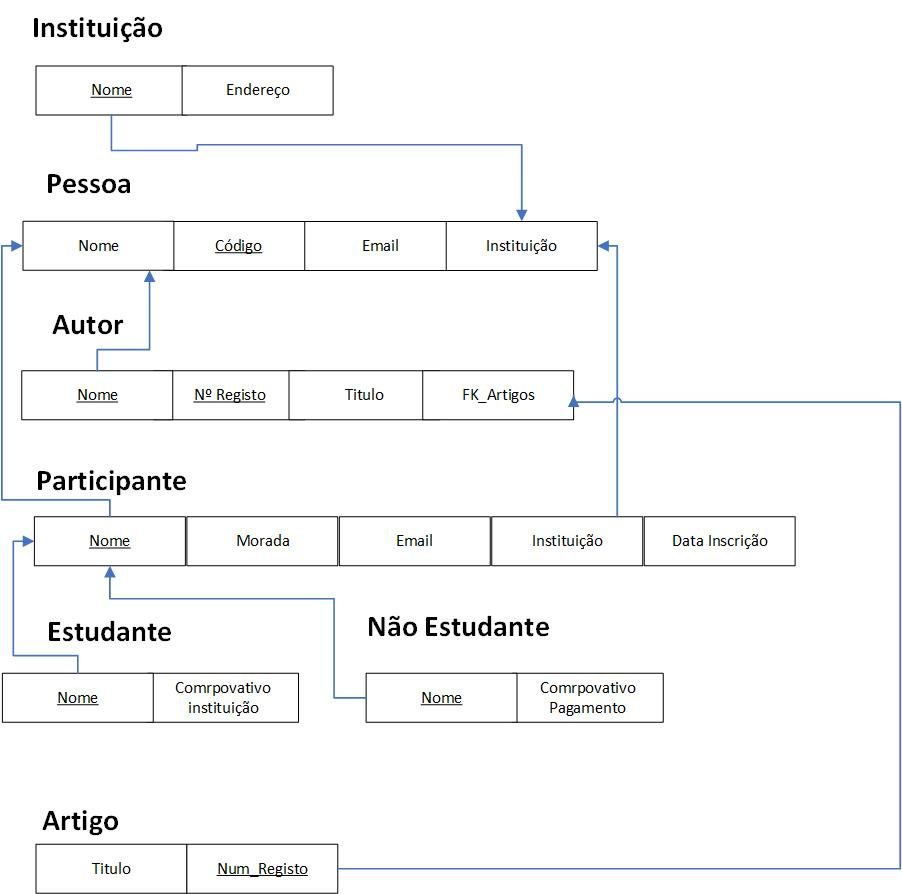
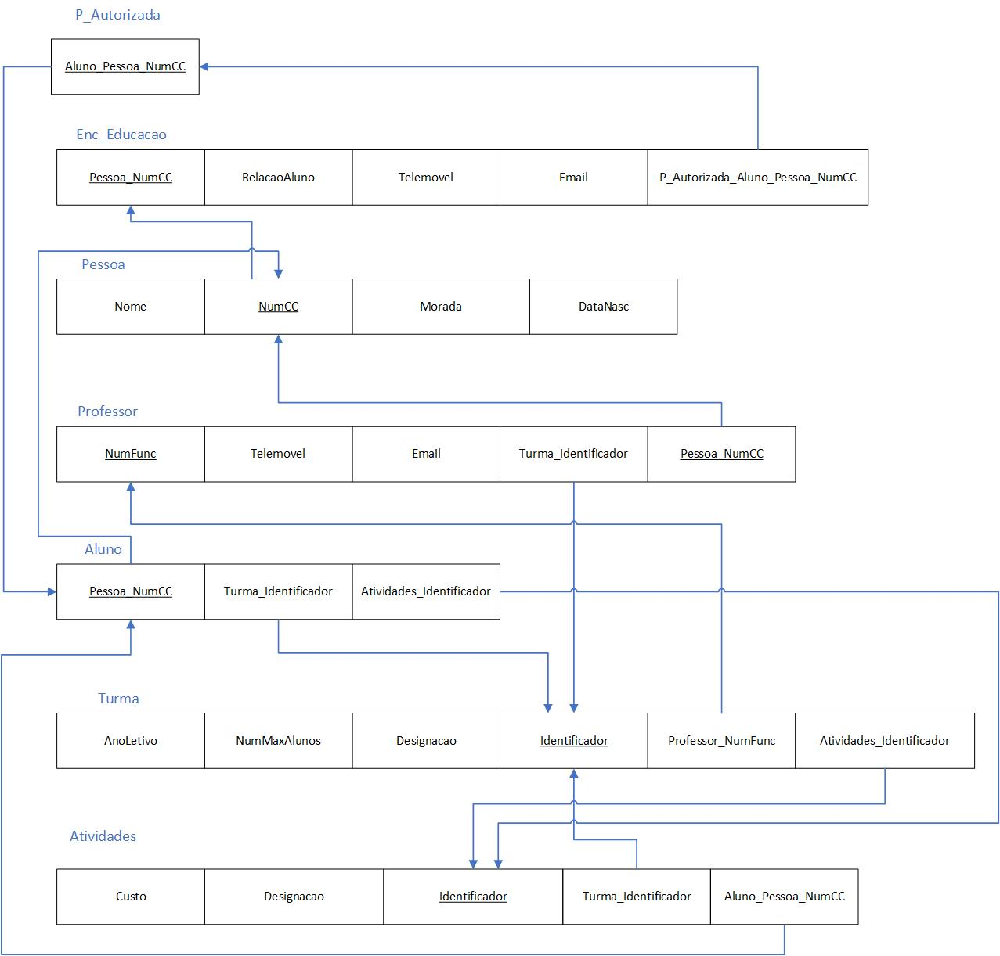

# BD: Guião 3


## ​Problema 3.1
 
### *a)*

```
Cliente (NIF,Nome,Endereço,num_carta)
Aluguer (Número, data, duração)
Balcão (Número,Nome,endereço)
Veículo (Matricula,Marca,Ano)
Tipo_Veiculo (Código,arcondicionado,designaçãlo)
Similariadade (Código 1, Código 2)
Ligeiro (Combustivel, portas, numlugares)
Pesado (peso,passageiros)
```


### *b)* 

```
Cliente:
candidatas: NIF, num_carta
primarias: NIF

Aluguer:
candidatas: numero
primarias: numero
estrangeiras: N_Balcao, clienteNIF

Balcao:
candidatas: numero
primarias: numero
estrangeiras: -

Veiculo:
candidatas: matricula
primarias: matricula
estrangeiras: codigo_Tipo_veiculo

Tipo_veiculo:
candidatas: codigo
primarias: codigo
estrangeiras: -

Ligeiro:
candidatas: primarias: TipoVei_codigo
primarias: TipoVei_codigo
estrangeiras: primarias: TipoVei_codigo

Pesado:
candidatas:codigo
primarias:codigo
estrangeiras:codigo

Similaridade:
candidatas:codigo
primarias: codigo1, codigo2
estrangeiras: codigo_Tipo_veiculo, codigo_Tipo_veiculo
```


### *c)* 




## ​Problema 3.2

### *a)*

```
Airport(Airport_code, City, State, Name)
Airplane_Type(Type_name, Company, Max_seats)
Airplane(Airplane_id, Total_no_of_seats, APType_name)
Flight(Number, Airline, Weekdays)
Flight_Leg(F_number, Leg_no, FAP_code, Scheduled_deptime, Scheduled_arrtime)
Fare(F_number, Code, Amount, Restrictions)
Leg_INSTANCE(FLeg_number, FLeg_no, date, No-of-avaiable-seats, F_APlane_id, AirP_code, Dep_time, Arr_time)
Seat(LeF_number, LeLeg_no, Led_date, Seat_no, Costumer_name, Cphone)
Can_Land(AP_code, APType_name)
```


### *b)* 

```
Airport (Chaves)
    candidatas: Airport_code
    primárias: Airport_code
    estrangeiras: --

Airplane_Type (Chaves)
    candidatas: name, Company
    primárias: name
    estrangeiras: --

Airplane (Chaves)
    candidatas: Airplane_id 
    primárias: Airplane_id
    estrangeiras: AirplaneType_name

Flight (Chaves)
    candidatas: Number, Airline
    primárias: Number
    estrangeiras:  --

Flight_Leg (Chaves)
    candidatas: number, Leg_no 
    primárias: number, Leg_no
    estrangeiras: number, Airport_code

Fare (Chaves)
    candidatas: number, code
    primárias: number, code
    estrangeiras: number

Leg_INSTANCE (Chaves)
    candidatas: Fleg_number, FLeg_no, date
    primárias: FLeg_number, FLeg_no
    estrangeiras: FLeg_number, FLeg_no, Plane_id, Airport_code

Seat (Chaves)
    candidatas: Fleg_number, Fleg_no, date, Seat_no 
    primárias: Fleg_number, Fleg_no, date, Seat_no
    estrangeiras: Fleg_number, Fleg_no, date

Can_Land (Chaves)
    candidatas: Airport_code, Airplane_type 
    primárias: Airport_code, Airplane_type
    estrangeiras: Airport_code, Airplane_type
```


### *c)* 




## ​Problema 3.3


### *a)* 2.1



### *b)* 2.2

 

### *c)* 2.3



### *d)* 2.4

